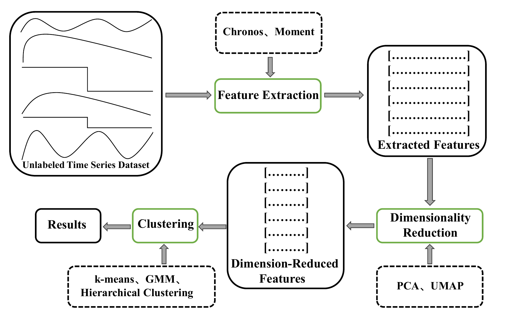

# TimeFM-Cluster: A Framework for Time Series Clustering via Foundation Models}
This repository is the official implementation of [TimeFM-Cluster: A Framework for Time Series Clustering via Foundation Models}] (Under Review)

## The overall execution process of applying the TimeFM-Cluster algorithm to time series clustering.

 

## Reproducibility

Our experiments were conducted on a computing platform equipped with a 13th Gen Intel(R) Core(TM) i7-13700KF processor (3.40 GHz), 32 GB of RAM, and an NVIDIA GeForce RTX 4090 GPU. The source codes for Chronos and Moment are publicly available through the repositories referenced in their respective publications. In TimeFM-Cluster, we employ the scikit-learn (sklearn) library to perform PCA-based dimensionality reduction, k-means, GMM, and hierarchical clustering, while UMAP is implemented using the umap-learn library https://github.com/lmcinnes/umap. 

## The UCR time series.

UCR dataset(https://www.cs.ucr.edu/~eamonn/time_series_data_2018/)

The processed datasets can be found in ”https://github.com/TheDatumOrg/kshape-python.“

## Results

We provide the ARI and NMI values of the 12 TimeFM-Cluster configurations across 128 benchmark datasets, which are available in the accompanying CSV file.

